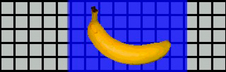
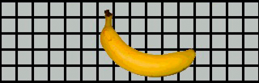
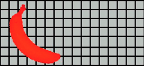

# Debugging an iPhone application

You can debug the application on the development computer, with the application
running in ADL. You can also debug the application on the iPhone.

Some AIR functionality that is not supported on the iPhone is still available
when testing an application using ADL (on the development computer). Be aware of
these differences when testing content on the desktop. For more information, see
[ActionScript 3.0 APIs unsupported on mobile devices](../actionscript-3.0-support-for-mobile-devices/actionscript-3.0-apis-unsupported-on-mobile-devices.md).

#### Debugging the application on the development computer

To debug the application on the development computer using Flash Professional
CS5:

 Choose Debug \> Debug Movie \> In AIR Debug Launcher
(Mobile).

You can also debug the application by calling ADL from the command line. This is
the syntax:

    adl –profile mobileDevice appDescriptorFile

Replace _`appDescriptorFile`_ with the path to the application descriptor file.

Be sure to include the `-profile mobileDevice` option.

#### Debugging the application on the iPhone

To debug the application on the iPhone:

1.  Compile the application with debug support:

    - In Flash Professional CS5, compile using the "Quick publishing for device
      debugging" setting. (See
      [Creating an iPhone application installer file using the Packager for iPhone included with in Flash Professional CS5](./compiling-an-iphone-application-installer-ipa-file/creating-an-iphone-application-installer-file-using-the-package-for-iphone-included-with-flash-professional-cs5.md).)

    - Using the PFI command-line application, compile the application with the
      `target ipa-debug` option. (See
      [Creating an iPhone application installer file from the command line](./compiling-an-iphone-application-installer-ipa-file/creating-an-iphone-application-installer-file-from-the-command-line.md).)

2.  Install the application on the iPhone.

3.  On the iPhone, turn Wi-Fi on and connect to the same network as that of the
    development computer.

4.  Start a debug session on your development computer. In Flash Professional
    CS5, choose Debug \> Begin Remote Debug Session \> ActionScript 3.0.

5.  Run the application on the iPhone.

    The debug version of the application will prompt you for the IP address of
    the developer computer. Enter the IP address and tap the OK button. To
    obtain the IP address of the development computer.

    - On Mac OS, on the Apple menu, choose System Preference. In the System
      Preferences window, click the Network icon. The Network preferences window
      lists the IP address.

    - On Windows, start a command-line session and run the `ipconfig` command.

The debug session displays any `trace()` output from the application.

When debugging an application installed on the iPhone, Flash Professional CS5
supports all debugging features, including breakpoint control, stepping through
code, and variable monitoring.

#### Debugging with GPU rendering diagnostics

The GPU rendering diagnostics feature lets you see how the application uses
hardware acceleration (for applications that use GPU rendering mode). To use
this feature, compile the application using the PFI tool on the command line,
and include the `-renderingdiagnostics` option:

    pfi -package -renderingdiagnostics -target ipa-debug -connect ...

The `-renderingdiagnostics` flag must directly follow the `-package` flag.

The GPU rendering diagnostic feature displays colored rectangles for all display
objects:

- Blue—The display object is not a bitmap or cached as a bitmap, and it is being
  rendered.

  If blue appears repeatedly for a display object that is not changing, it could
  be because it intersects with moving display objects. For example, the display
  object may be a background for moving display objects. Consider caching the
  display object as a bitmap.

  If blue appears for an object that you think should be cached, it may be
  because the object is using an effect that the GPU cannot apply. These effects
  include certain blend modes, color transforms, the `scrollRect` property, and
  masks.

  The application also displays blue if display objects uploaded to the GPU
  exceed the memory limits.

  The application logs messages for each blue rectangle. The application outputs
  these messages along with other `trace()` and debug output messages.

- Green—The display object is a bitmap or cached as a bitmap, and it is being
  uploaded to the GPU for the first time.

  If green appears repeatedly for a display object, then the code in the
  application is recreating the display object. For example, this can occur if
  the timeline returns to a frame that creates the display object. Consider
  modifying the content to prevent re-creation of identical objects.

- Red—The display object is a bitmap or cached as a bitmap, and it is being
  re-uploaded to the GPU.

  Red appears every time such a display object changes in a way that requires
  the application to re-render the bitmap representation. For example, if a 2D
  object that does not have the `cacheAsBitmapMatrix` property set, it is
  re-rendered when it is scaled or rotated. Re-rendering also occurs when child
  display objects move or change.

Each colored rectangle fades after four screen redraw cycles, provided the
reason for the coloration does not occur again during those cycles. However, if
there are no changes onscreen, the diagnostic coloring does not change.

For example, consider a bitmap display object (a banana) in front of a vector
background that is not cached as a bitmap. When the banana first renders, it is
colored green. When the background first renders, it is colored blue:

As the banana moves, the CPU must re-render the background, causing the blue
shading to appear over the background:

The blue shading over the background reflects redrawn regions that need to be
sent to the GPU.

However, if the background is cached as a bitmap, when the banana moves, the
rendering diagnostic feature displays no colored tints:

The diagnostic feature displays no colored tints since the GPU retains the
background bitmap. The GPU can composite the banana with the background without
involving the CPU.

Suppose the banana is a 2D display object that does not have its
`cacheAsBitmapMatrix` property set. Whenever the display object rotates (or
scales), the rendering diagnostic feature displays red. This indicates that the
application has to upload a new version of the display object to the GPU:

